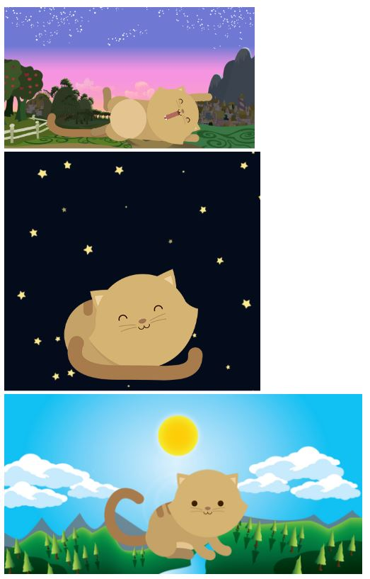

# Kitten

* **Track:** _Common Core_
* **Curso:** _Crea tu propia red social_
* **Unidad:** _La web desde un móvil_

***
## Objetivo
---
El reto consiste en realizar una página web responsive con un grid para tres dimensiones diferentes, en las que se muestre un fondo y una figura de gato diferente para cada caso. La página debe verse así:

## Contenido

Este proyecto contiene:

1. Un archivo `index.html` que contiene la estructura inicial de la página web. Este debe contener las siguientes secciones:
* Un contenedor para aplicar el grid.
* Un div para aplicar un fondo y contener una imagen de gato.

2. Una carpeta `assets` donde se encuentra la carpeta `docs` que contiene la imagen en formato ***jpg*** de las tres versiones de la página web a replicar.

3. Una carpeta `css` que contiene un archivo `main.css` donde hay clases reutilizables y específicas para darle estilo a la página web.

4. Un archivo  **`README.md`** que explica el contenido del repositorio.

## Autora
Lizbeth Félix Peña

## Fecha
09/12/2017
